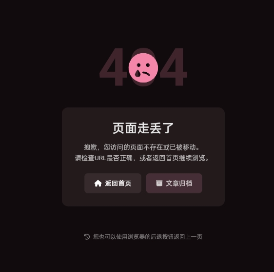

# 本文章分为两部分  
### 适配多语言的404界面  
打开**src/i18n/i18nKey.ts**  
```typescript
	license = "license",
	friends = "friends",

	// 404 page
	notFound = "notFound",
	notFoundTitle = "notFoundTitle",
	notFoundMessage = "notFoundMessage",
	backToHome = "backToHome",
	viewArchive = "viewArchive",
```  
再分别打开languages下的**en.ts**和**zh_CN.ts**  
en.ts
```typescript
	[Key.license]: "License",
	[Key.friends]: "Friends",

	// 404 page
	[Key.notFound]: "Page Not Found",
	[Key.notFoundTitle]: "Oops! Page Not Found",
	[Key.notFoundMessage]: "The page you are looking for doesn't exist. It may have been moved or deleted.",
	[Key.backToHome]: "Back to Home",
	[Key.viewArchive]: "View Archive",
```  
zh_CN.ts
```typescript
	[Key.license]: "许可协议",
	[Key.friends]: "友链",

	// 404 page
	[Key.notFound]: "页面未找到",
	[Key.notFoundTitle]: "哎呀！页面走丢了",
	[Key.notFoundMessage]: "您访问的页面不存在，可能已被删除或链接有误。",
	[Key.backToHome]: "返回首页",
	[Key.viewArchive]: "查看归档",
```  
最后在**src/pages**目录下创建**404.astro**  
```astro
---
import { Icon } from "astro-icon/components";
import MainGridLayout from "../layouts/MainGridLayout.astro";
import I18nKey from "../i18n/i18nKey";
import { i18n } from "../i18n/translation";
import { url } from "../utils/url-utils";
import { siteConfig } from "../config";
---

<MainGridLayout title={i18n(I18nKey.notFound)} description={i18n(I18nKey.notFoundMessage)}>
    <div class="flex w-full rounded-[var(--radius-large)] overflow-hidden relative min-h-96">
        <div class="card-base z-10 px-6 md:px-12 py-8 md:py-12 relative w-full">
            <!-- 404 Content -->
            <div class="flex flex-col items-center text-center space-y-6">
                <!-- Large 404 Number -->
                <div class="relative opacity-0 animate-fade-in-up">
                    <div class="text-8xl md:text-9xl font-bold bg-gradient-to-br from-[var(--primary)] to-[oklch(0.65_0.18_var(--hue))] bg-clip-text text-transparent select-none">
                        404
                    </div>
                    <!-- Decorative elements -->
                    <div class="absolute -top-4 -right-4 w-8 h-8 bg-[var(--primary)] rounded-full opacity-20 animate-pulse"></div>
                    <div class="absolute -bottom-2 -left-2 w-6 h-6 bg-[var(--primary)] rounded-full opacity-30 animate-pulse" style="animation-delay: 0.5s;"></div>
                </div>

                <!-- Title and Message -->
                <div class="space-y-3 max-w-md opacity-0 animate-fade-in-up animate-delay-100">
                    <h1 class="text-2xl md:text-3xl font-bold text-[var(--primary)]">
                        {i18n(I18nKey.notFoundTitle)}
                    </h1>
                    <p class="text-75 text-base md:text-lg leading-relaxed">
                        {i18n(I18nKey.notFoundMessage)}
                    </p>
                </div>

                <!-- Illustration -->
                <div class="py-4 opacity-0 animate-fade-in-up animate-delay-200">
                    <div class="relative w-32 h-32 mx-auto animate-float">
                        <!-- Simple geometric illustration -->
                        <div class="absolute inset-0 bg-gradient-to-br from-[var(--primary)] to-[oklch(0.65_0.18_var(--hue))] rounded-full opacity-10"></div>
                        <div class="absolute inset-4 bg-[var(--card-bg)] rounded-full border-2 border-[var(--primary)] border-opacity-20"></div>
                        <div class="absolute inset-0 flex items-center justify-center">
                            <Icon name="fa6-solid:location-crosshairs" class="w-12 h-12 text-[var(--primary)] opacity-60" />
                        </div>
                    </div>
                </div>

                <!-- Action Buttons -->
                <div class="flex flex-col sm:flex-row gap-3 pt-4 opacity-0 animate-fade-in-up animate-delay-300">
                    <a href={url("/")} 
                       class="btn-regular px-6 py-3 rounded-xl font-medium transition-all duration-200 hover:scale-105 active:scale-95 flex items-center justify-center gap-2">
                        <Icon name="fa6-solid:house" class="w-4 h-4" />
                        {i18n(I18nKey.backToHome)}
                    </a>
                    <a href={url("/archive")} 
                       class="btn-card px-6 py-3 rounded-xl font-medium transition-all duration-200 hover:scale-105 active:scale-95 flex items-center justify-center gap-2 border border-[var(--line-divider)]">
                        <Icon name="fa6-solid:box-archive" class="w-4 h-4" />
                        {i18n(I18nKey.viewArchive)}
                    </a>
                    <a href={url("/about")} 
                       class="btn-card px-6 py-3 rounded-xl font-medium transition-all duration-200 hover:scale-105 active:scale-95 flex items-center justify-center gap-2 border border-[var(--line-divider)]">
                        <Icon name="fa6-solid:circle-info" class="w-4 h-4" />
                        {i18n(I18nKey.about)}
                    </a>
                </div>

                <!-- Additional Help Text -->
                <div class="pt-6 text-sm text-50">
                    <p class="transition-all duration-300">
                        {siteConfig.lang === 'zh_CN' ? '如果您认为这是一个错误，请联系网站管理员。' : 'If you believe this is an error, please contact the site administrator.'}
                    </p>
                </div>
            </div>
        </div>
    </div>
</MainGridLayout>

<style>
    @keyframes float {
        0%, 100% { transform: translateY(0px); }
        50% { transform: translateY(-10px); }
    }
    
    @keyframes fadeInUp {
        from {
            opacity: 0;
            transform: translateY(30px);
        }
        to {
            opacity: 1;
            transform: translateY(0);
        }
    }
    
    .animate-float {
        animation: float 3s ease-in-out infinite;
    }
    
    .animate-fade-in-up {
        animation: fadeInUp 0.6s ease-out forwards;
    }
    
    .animate-delay-100 {
        animation-delay: 0.1s;
    }
    
    .animate-delay-200 {
        animation-delay: 0.2s;
    }
    
    .animate-delay-300 {
        animation-delay: 0.3s;
    }
    
    .animate-delay-400 {
        animation-delay: 0.4s;
    }
</style>
```  

### 单语言404.astro  
此方法直接在**src/pages**目录下创建404.astro即可  
由于我没有语言的404，这里附上二叉树树的404界面  
预览：
```astro
---
import Layout from "@/layouts/Layout.astro";
import MainGridLayout from "@/layouts/MainGridLayout.astro";
import { Icon } from "astro-icon/components";
import { siteConfig } from "@/config";
---

<Layout title="页面未找到">
        <MainGridLayout>
                <div class="flex flex-col items-center justify-center min-h-[60vh] text-center px-4">
                        <!-- 404 图标 -->
                        <div class="mb-8">
                                <div class="relative">
                                        <div class="text-8xl md:text-9xl font-bold text-[var(--primary)] opacity-20">
                                                404
                                        </div>
                                        <div class="absolute inset-0 flex items-center justify-center">
                                                <Icon name="fa6-solid:face-sad-tear" class="text-6xl md:text-7xl text-[var(--primary)]" />
                                        </div>
                                </div>
                        </div>

                        <!-- 错误信息 -->
                        <div class="card-base p-8 max-w-md mx-auto mb-8">
                                <h1 class="text-2xl md:text-3xl font-bold text-90 mb-4">
                                        页面走丢了
                                </h1>
                                <p class="text-75 mb-6 leading-relaxed">
                                        抱歉，您访问的页面不存在或已被移动。
                                        <br>
                                        请检查URL是否正确，或者返回首页继续浏览。
                                </p>

                                <!-- 导航按钮 -->
                                <div class="flex flex-col sm:flex-row gap-3 justify-center">
                                        <a href="/" class="btn-regular-dark px-6 py-3 rounded-lg text-white font-medium">
                                                <Icon name="fa6-solid:house" class="mr-2" />
                                                返回首页
                                        </a>
                                        <a href="/archive/" class="btn-regular px-6 py-3 rounded-lg font-medium">
                                                <Icon name="fa6-solid:box-archive" class="mr-2" />
                                                文章归档
                                        </a>
                                </div>
                        </div>

                        <!-- 返回提示 -->
                        <div class="mt-8 text-50 text-sm">
                                <p class="flex items-center justify-center">
                                        <Icon name="fa6-solid:clock-rotate-left" class="mr-2" />
                                        您也可以使用浏览器的后退按钮返回上一页
                                </p>
                        </div>
                </div>
        </MainGridLayout>
</Layout>
```  
